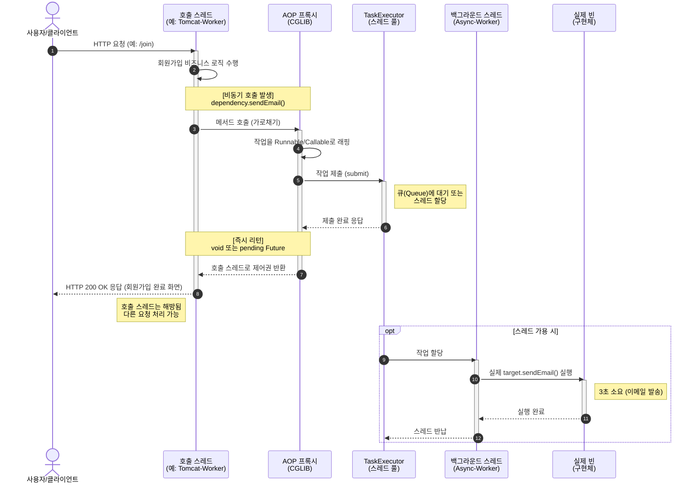

<div align="center">

# 비동기 (Asynchronous)

`하나의 서비스에서 기능을 순차 처리해 응답 속도 느려지기 때문에 작업이 완료될 때까지 기다리지 않고 다음 코드를 실행하는 방식` 

</div>

## @Async

`AOP(Aspect-Oriented Programming) 기반의 프록시(Proxy) 패턴` 

`@EnableAsync 비동기 기능 활성화`

```java
// 둘 중 한 방법 사용
// 1. main 클래스
@EnableAsync 
@SpringBootApplication
public class MyApplication {
    public static void main(String[] args) {
        SpringApplication.run(MyApplication.class, args);
    }
}

// 2. 설정 클래스
@EnableAsync    
@Configuration  
public class AsyncConfig {

}
```

`@Async 사용`

```java
@Service
public class ExService {
    @Async
    public void ex() {
        // 로직
    }
}
```

`@Async 프록시 객체`

```java
// Spring CGLIB가 ExService를 상속받아 만든 프록시 클래스
public class ExService$$EnhancerBySpringCGLIB extends ExService {
    // 진짜 객체(Target)
    private final ExService target; 
    
    // 비동기 스레드 풀 주입
    private final AsyncTaskExecutor executor; 

    public ExService$$EnhancerBySpringCGLIB(ExService target, AsyncTaskExecutor executor) {
        this.target = target;
        this.executor = executor;
    }

    // 원본 메서드를 오버라이딩
    @Override
    public void ex() {
        // 프록시가 가로채서 수행하는 추가 로직

        // 진짜 실행해야 할 원본 메서드 Runnable(or Callable)로 생성 
        Runnable task = new Runnable() {
            @Override
            public void run() {
                try {
                    // 진짜 객체 메서드 호출
                    target.ex(); 
                } catch (Throwable ex) {
                    // 예외 발생 시 AsyncUncaughtExceptionHandler
                    handleException(ex); 
                }
            }
        };

        // Executor 스레드 풀 (비동기 처리)
        executor.submit(task);

        // 메인 톰캣(WAS) 스레드 리턴되어 클라이언트 응답
        return; 
    }
}

```

### SimpleAsyncTaskExecutor

`요청이 올 때마다 자동으로 매번 새로운 스레드 생성/소멸됨`

- 비동기 요청에 따라 새 스레드가 계속 생겨 OutOfMemoryError 발생할 수 있음

### ThreadPoolTaskExecutor

`비동기를 위해 애플리케이션 레벨에서 사용하는 스레드 풀`

```text
실제 톰캣 스레드 -> 전환되는거 

```



``

```java
public interface AsyncConfigurer {
	@Nullable
	default Executor getAsyncExecutor() { return null; }

	@Nullable
	default AsyncUncaughtExceptionHandler getAsyncUncaughtExceptionHandler() { return null; }
}
```

`ThreadPoolTaskExecutor 설정`

```java
@Configuration
@EnableAsync
public class AsyncConfig implements AsyncConfigurer {

    @Override
    public Executor getAsyncExecutor() {
        ThreadPoolTaskExecutor executor = new ThreadPoolTaskExecutor();
        executor.setCorePoolSize(10);
        executor.setMaxPoolSize(20);
        executor.setQueueCapacity(100);
        executor.setThreadNamePrefix("async-");

        // TaskDecorator 설정(SecurityContext 전파)
        executor.setTaskDecorator(new SecurityContextTaskDecorator());

        executor.initialize();
        return executor;
    }

    @Override
    public AsyncUncaughtExceptionHandler getAsyncUncaughtExceptionHandler() {
        return (throwable, method, params) -> {
            System.err.println("비동기 메서드 예외 발생: " + method.getName());
            throwable.printStackTrace();
        };
    }
}
```

#### 큐 
